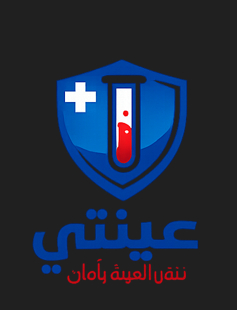
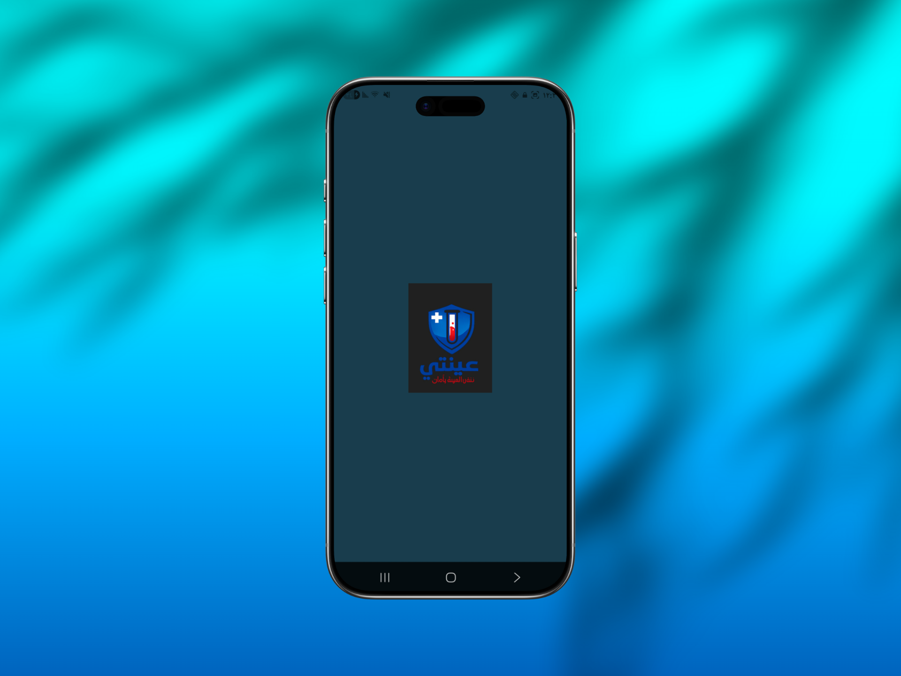
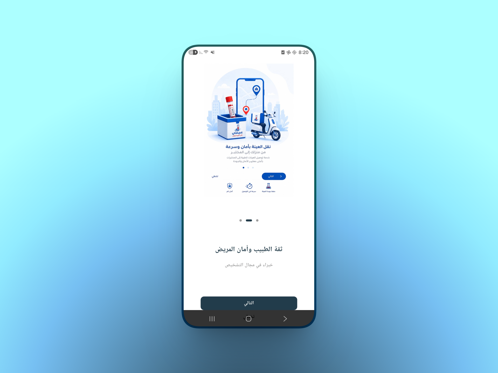
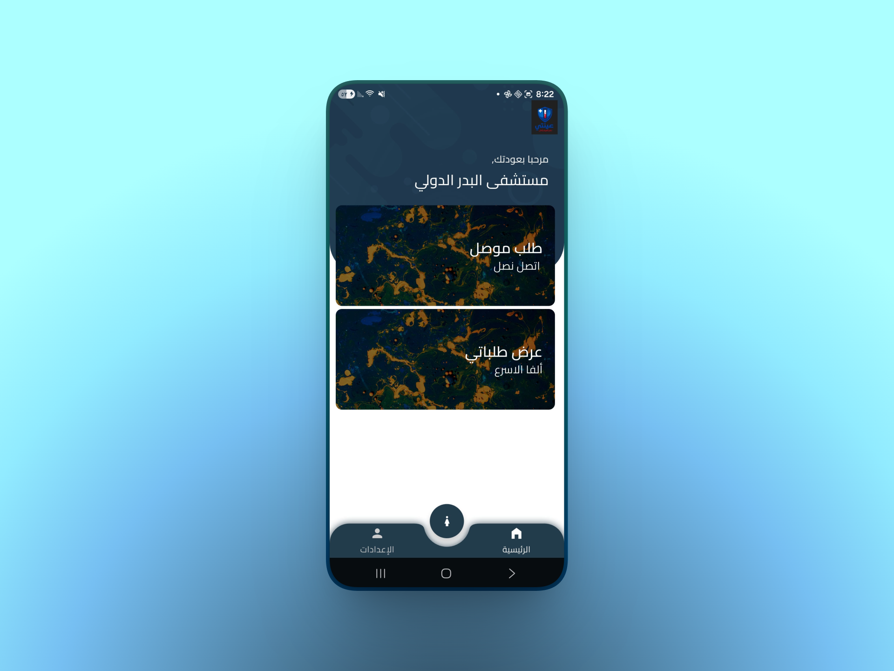
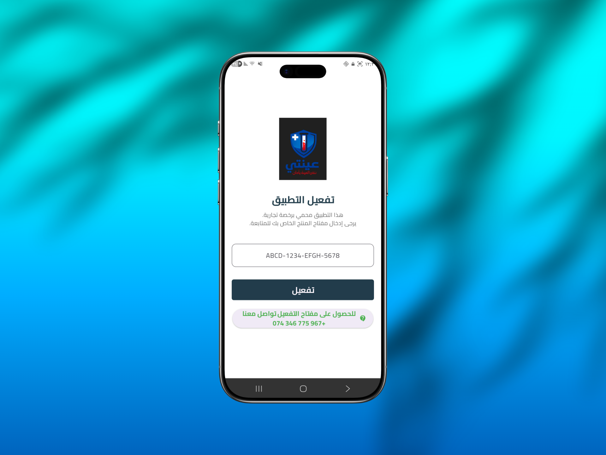
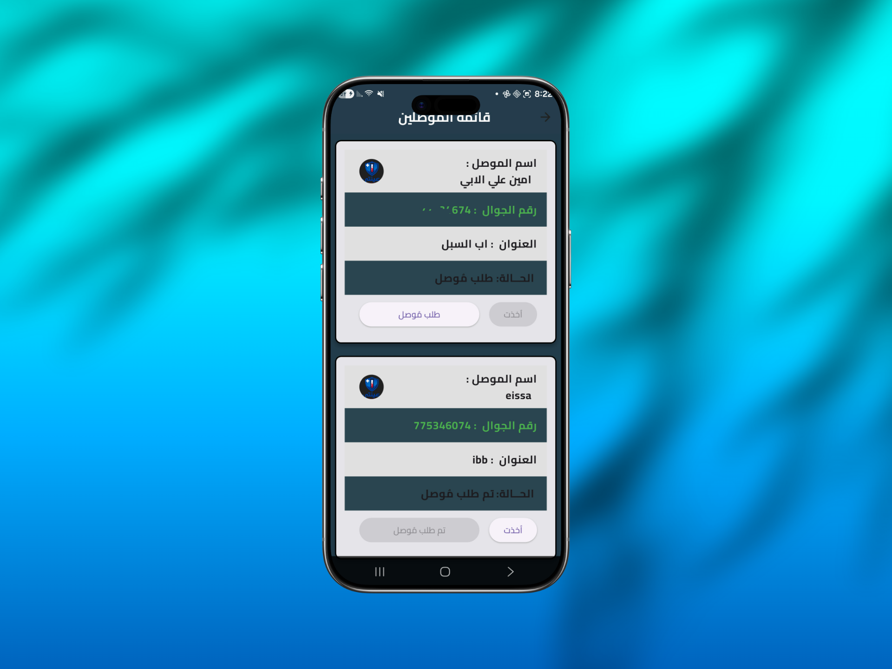
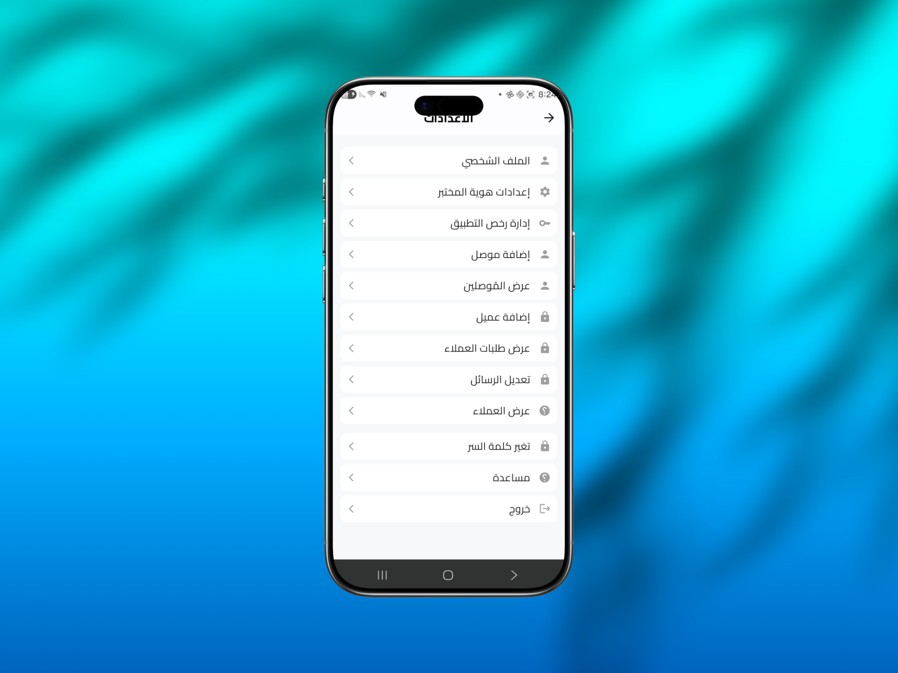

<div align="center">
  
  
  # عينتي - تطبيق توصيل العينات المخبرية
  **Laboratory Sample Delivery App**
</div>

---

## 📝 نبذة عن التطبيق (About)
تطبيق **عينتي** هو نظام متكامل ومخصص لإدارة وتوصيل العينات المخبرية. يهدف التطبيق إلى تسهيل عملية تتبع العينات من وقت استلامها من العميل (المستوصف/العيادة) حتى تسليمها للمختبر، مع توفير واجهة سهلة الاستخدام للمناديب والمختبرات ومدراء النظام.

## ✨ المميزات (Features)
- 🚚 **إدارة التوصيل**: تتبع مسار العينات وحالاتها بسهولة.
- 👥 **إدارة المستخدمين**: نظام صلاحيات متعدد (مدير، مندوب، عميل).
- 🔔 **إشعارات فورية (Push Notifications)**: تنبيهات لحظية بحالة الطلبات عبر منصة Firebase.
- 🌍 **دعم اللغات**: واجهة مستخدم مبنية باللغة العربية (مع قابلية التوسع للغات أخرى).
- 📱 **تحديثات لحظية**: استخدام قاعدة بيانات Firestore لمزامنة البيانات في الوقت الفعلي (Realtime).
- 🔒 **نظام تراخيص**: إدارة ومتابعة تراخيص الاستخدام للتطبيق (License Management).

## 🛠️ التقنيات المستخدمة (Technologies)
- **إطار العمل (Framework)**: [Flutter](https://flutter.dev/) & Dart
- **إدارة الحالة (State Management)**: [GetX](https://pub.dev/packages/get)
- **قاعدة البيانات (Database)**: Firebase Firestore
- **الإشعارات (Notifications)**: Firebase Cloud Messaging (FCM) & Flutter Local Notifications

## 📸 لقطات من التطبيق (Screenshots)

<p align="center">
  
   
  
  <br><br>
  
  
  
</p>

## 🚀 البدء السريع (Getting Started)

1. **استنساخ المستودع (Clone the repo):**
   ```bash
   git clone https://github.com/Algomaie/laboratory_sample_delivery.git
   ```

2. **تثبيت الحزم (Install Dependencies):**
   ```bash
   cd laboratory_sample_delivery
   flutter pub get
   ```

3. **إعداد Firebase:**
   - يجب إضافة ملف `google-services.json` الخاص بمشروعك في مسار `android/app/`.
   - يجب إضافة ملف `firebase_options.dart` في مسار `lib/`.
   - قم بإنشاء ملف `.env` في الجذر الرئيسي للمشروع يحتوي على مفاتيحك الخاصة، مثال:
     ```env
     FCM_SERVER_KEY=your_server_key_here
     ```

4. **تشغيل التطبيق (Run the app):**
   ```bash
   flutter run
   ```

## 📞 الدعم والمساعدة (Support)
لأي استفسارات أو لطلب الدعم الفني، يرجى التواصل عبر:
- **رقم الهاتف**: [+967775346074](tel:+967775346074)
- **البريد الإلكتروني**: [algomaieissa@gmail.com](mailto:algomaieissa@gmail.com)

---
*تم بناء هذا المشروع ليكون حلاً تقنياً متقدماً في إدارة المختبرات الطبية وتوصيل عيناتها بدقة وأمان.*
